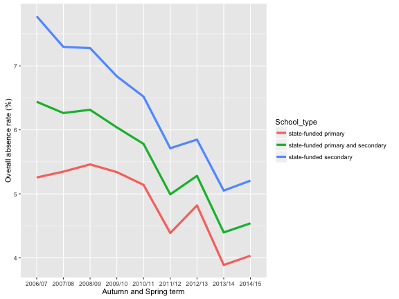
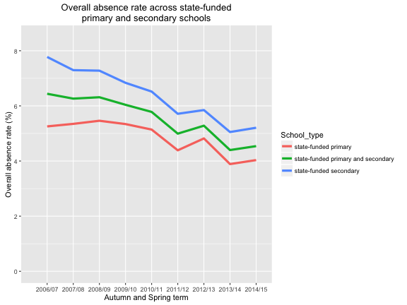
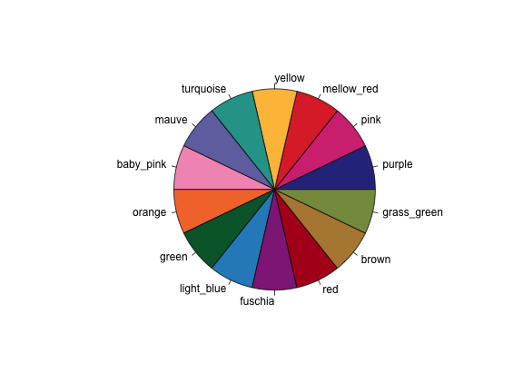
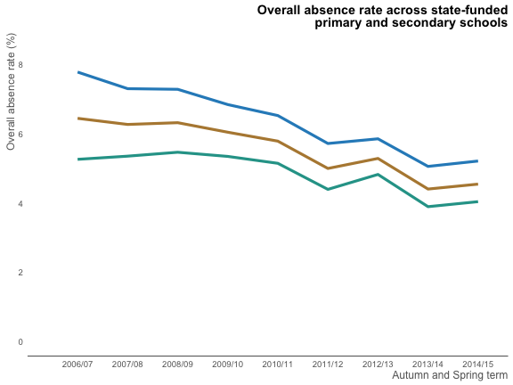
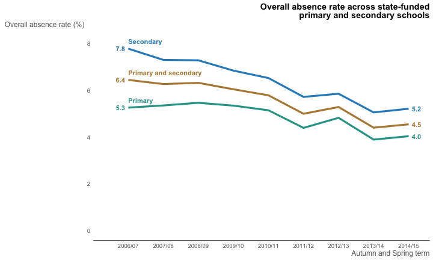
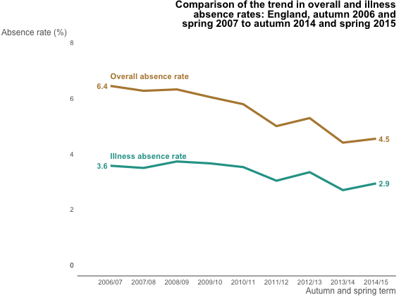

The [govstyle](https://github.com/ivyleavedtoadflax/govstyle) package is designed to give your ggplot2 figures [gov.uk](https://www.gov.uk/) friendly formatting.
At present the package consists of a single theme which can be applied to ggplots.
More functionality will be added in the future.

## A real life example

In this vignette, we will reproduce two of the plots presented in the 2015 Statistical First Release (SFR) 39 from the Department of Education.
This SFR deals with statistics relating to student absence and exclusion, and is available for download [here](https://www.gov.uk/government/uploads/system/uploads/attachment_data/file/468965/SFR39_2015_Text.pdf).

### Getting the data

The first step is to download and prepare the data.
The SFR data are stored as a large (41.7 MB) CSV file within a zip file, which is available [here]("https://www.gov.uk/government/uploads/system/uploads/attachment_data/file/468966/SFR39_2015_Underlying_data.zip").

Downloading and extracting the data can all be done in R


It's worth doing a quick check to ensure that this worked:


```r
file.exists("SFR39_2015_Autumn_Spring_Proposed_SFR_structure.csv")
```

```
## [1] TRUE
```

```r
## Should be 43776735 bytes:

file.info("SFR39_2015_Autumn_Spring_Proposed_SFR_structure.csv")$size
```

```
## [1] 43776735
```

We also need to install the `govstyle` package.
This vignette uses version `v0.1.0` - leaving out this argument from `devtools::install_github` will fetch the latest commit on the master branch


```r
devtools::install_github(
  repo = "ivyleavedtoadflax/govstyle"
)

library(govstyle)
```

### Loading and cleaning the data

If all has gone well, we can load the data and make some basic maniuplations.
For this we need both `readr` and `dplyr`:


```r
library(readr)
library(dplyr)
```

Here I use the `dplyr` framework using the pipe `%>%` to combine a lot of cleaning tasks into a single block of code.
First I load the data from CSV using `readr::read_csv()`, then use `dplyr::select()` and `dplyr::mutate()` to subset the columns I am interested in, and convert character columns to 


```r
absence_data_full <- read_csv(
  file = "SFR39_2015_Autumn_Spring_Proposed_SFR_structure.csv",
  na = c( "x", ".", "")
) %>%
  mutate(
    Period = factor(Period),
    Level = factor(Level),
    Year = factor(Year),
    Country = factor(Country),
    School_type = School_type %>% tolower %>% factor
  )

# For brevity of printing, select only columns of interest.

absence_data <- absence_data_full %>%
  select(
    Period, Level, Year, Country,
    School_type, sess_possible, sess_overall
  )
```

From a quick scan of the data, we can see that all the remaining character columns have been converted to factor, and we have two remaining numeric columns which are integer.


```r
absence_data
```

```
## Source: local data frame [185,543 x 7]
## 
##               Period    Level    Year Country            School_type
##               (fctr)   (fctr)  (fctr)  (fctr)                 (fctr)
## 1  Autumn and spring NATIONAL 2014/15 England   state-funded primary
## 2  Autumn and spring NATIONAL 2014/15 England state-funded secondary
## 3  Autumn and spring   REGION 2014/15 England   state-funded primary
## 4  Autumn and spring   REGION 2014/15 England state-funded secondary
## 5  Autumn and spring   REGION 2014/15 England   state-funded primary
## 6  Autumn and spring   REGION 2014/15 England state-funded secondary
## 7  Autumn and spring   REGION 2014/15 England   state-funded primary
## 8  Autumn and spring   REGION 2014/15 England state-funded secondary
## 9  Autumn and spring   REGION 2014/15 England   state-funded primary
## 10 Autumn and spring   REGION 2014/15 England state-funded secondary
## ..               ...      ...     ...     ...                    ...
## Variables not shown: sess_possible (int), sess_overall (int)
```

### Calculating Overall Absence Rate

To recreate the plots in the SFR, we first need to calculate the national overall absence rate (OAR), which is given as:

>  the total number of overall absence sessions for all pupils as a percentage of the total number of possible sessions for all pupils, where overall absence is the sum of authorised and unauthorised absence and one session is equal to half a day.

or:

$$
\text{Overall absence rate} = \frac{\text{Total Overall absence sessions}}{\text{Total sessions possible}}\times 100
$$ 

For this we need to subset the data and calculate this at the national level, and combine this calculation with the regional data


```r
# Calculate the national OAR values.

oar_summary <- absence_data %>%
  dplyr::filter(
    Level == "NATIONAL"
  ) %>%
  mutate(
    oar = (sess_overall/sess_possible) * 100
  )

# Calculate the OAR values for Period, Level, Year, and Country combinations

oar_summary_combined <- absence_data %>%
  dplyr::filter(
    Level == "NATIONAL"
  ) %>%
  group_by(Period, Level, Year, Country) %>%
  summarise(
    sess_possible = sum(sess_possible),
    sess_overall = sum(sess_overall)
  ) %>%
  mutate(
    oar = (sess_overall/sess_possible) * 100,
    School_type = "state-funded primary and secondary"
  )

# Combine the two above dataframes

oar_summary <- bind_rows(
  oar_summary,
  oar_summary_combined
)
```

Note that combining the two dataframes above leads to `School_type` being coerced to character.
This is not an issue for use here.


```r
oar_summary
```

```
## Source: local data frame [27 x 8]
## 
##               Period    Level    Year Country            School_type
##               (fctr)   (fctr)  (fctr)  (fctr)                  (chr)
## 1  Autumn and spring NATIONAL 2014/15 England   state-funded primary
## 2  Autumn and spring NATIONAL 2014/15 England state-funded secondary
## 3  Autumn and spring NATIONAL 2013/14 England   state-funded primary
## 4  Autumn and spring NATIONAL 2013/14 England state-funded secondary
## 5  Autumn and spring NATIONAL 2012/13 England   state-funded primary
## 6  Autumn and spring NATIONAL 2012/13 England state-funded secondary
## 7  Autumn and spring NATIONAL 2011/12 England   state-funded primary
## 8  Autumn and spring NATIONAL 2011/12 England state-funded secondary
## 9  Autumn and spring NATIONAL 2010/11 England   state-funded primary
## 10 Autumn and spring NATIONAL 2010/11 England state-funded secondary
## ..               ...      ...     ...     ...                    ...
## Variables not shown: sess_possible (int), sess_overall (int), oar (dbl)
```

### Creating the first plot

For the first plot, we also need the values from the start and end of the timeseries for inclusion in the plot.


```r
oar_values <- oar_summary %>% 
  filter(
    Year %in% c("2006/07","2014/15")
  ) %>%
  arrange(Year)


oar_values
```

```
## Source: local data frame [6 x 8]
## 
##              Period    Level    Year Country
##              (fctr)   (fctr)  (fctr)  (fctr)
## 1 Autumn and spring NATIONAL 2006/07 England
## 2 Autumn and spring NATIONAL 2006/07 England
## 3 Autumn and spring NATIONAL 2006/07 England
## 4 Autumn and spring NATIONAL 2014/15 England
## 5 Autumn and spring NATIONAL 2014/15 England
## 6 Autumn and spring NATIONAL 2014/15 England
## Variables not shown: School_type (chr), sess_possible (int), sess_overall
##   (int), oar (dbl)
```

To produce a nice plot ends up in quite a lot of code, so I will build up bit by bit.


```r
library(ggplot2)

p <- oar_summary %>%
  ggplot +
  aes(
    x = Year,
    y = oar,
    colour = School_type,
    fill = School_type,
    group = School_type
  ) +
  geom_path(size = 1.5) +
  xlab("Autumn and Spring term") +
  ylab("Overall absence rate (%)")
```

This gives us our base plot


```r
p 
```


  
Government tends to like seeing zero on the y-axis, so lets fix the axes with `expand_limits()`, and add a title with `ggtitle`.


```r
p1 <- p + 
  expand_limits(
    x = 0, 
    y = c(0, 8.5)
    )   +
  ggtitle(
    "Overall absence rate across state-funded\nprimary and secondary schools"
  ) 

p1
```



At this point I apply `theme_gov()`, and introduce a scale using colours from the gov.uk colour palette.
For this we can call `check_pal()`


```r
check_pal()
```




```r
p2 <- p1 +
  theme_gov(
    base_size = 12, 
    base_colour = "gray40") +
  scale_colour_manual(
    values =  gov_cols[c("turquoise","brown","light_blue")] %>% unname
  )

p2
```



`theme_gov()` removes the legend by default, so I'll label the lines instead.
This gets a little complicated here as we need to nudge the values into the correct place using the `hjust` and `vjust` arguments.
I also use the `sprintf()` command to force R to print a single decimal place, even if this number is zero - the default would be not to do this.


```r
p3 <- p2 +
  geom_text(
    data = oar_values,
    aes(
      label = sprintf("%.1f", oar)
      ),
    hjust = rep(c(1.35,-0.35), each = 3),
    fontface = "bold"
  )+
  geom_text(
    data = oar_summary %>% filter(Year == "2006/07"),
    aes(
      label = c(
        "Primary",
        "Secondary",
        "Primary and secondary"
      )
    ),
    hjust = 0,
    vjust = -1,
    fontface = "bold"
  )

p3 
```


So this is pretty close to the final figure.
One thing we might want to do is rotate the y-axis label so that it reads horizontally


```r
p4 <- p3 + 
  theme(
    # plot.margin = grid::unit(
    #   c(0, 5, 5, 0), "mm"),
    axis.title.y = element_text(
      angle = 0
      )
  )

p4 
```



### Creating the second plot

## Illness absence rates

Start with the full absence data. Filter to only NATIONAL values, then sum over years for the variables `sess_overall`, `sess_possible`, and `sess_auth_illness`. Then calculate the overall absence rate, and the illness absence rate, and finally gather this up into a long rather than a wide `data.frame` to allow easier plotting of colours


```r
illness_summary <- absence_data_full %>%
  dplyr::filter(Level == "NATIONAL") %>%
  group_by(Year) %>%
  summarise(
    sess_overall = sum(sess_overall),
    sess_possible = sum(sess_possible),
    sess_auth_illness = sum(sess_auth_illness)
  ) %>%
  mutate(
    oar = (sess_overall / sess_possible) * 100,
    iar = (sess_auth_illness / sess_possible) * 100
  ) %>%
  tidyr::gather(key, value, oar:iar)

illness_summary
```

```
## Source: local data frame [18 x 6]
## 
##       Year sess_overall sess_possible sess_auth_illness   key    value
##     <fctr>        <int>         <int>             <int> <chr>    <dbl>
## 1  2006/07    101688627    1579151686          56318795   oar 6.439446
## 2  2007/08     92716911    1480357958          51614916   oar 6.263141
## 3  2008/09     99518296    1576211246          58638736   oar 6.313766
## 4  2009/10     91532020    1515697308          55355370   oar 6.038938
## 5  2010/11     92722678    1603871560          56428397   oar 5.781179
## 6  2011/12     76087568    1524001108          46140038   oar 4.992619
## 7  2012/13     79741964    1509825224          50356903   oar 5.281536
## 8  2013/14     71314855    1621608727          43602079   oar 4.397784
## 9  2014/15     72146803    1589076637          46573697   oar 4.540171
## 10 2006/07    101688627    1579151686          56318795   iar 3.566396
## 11 2007/08     92716911    1480357958          51614916   iar 3.486651
## 12 2008/09     99518296    1576211246          58638736   iar 3.720233
## 13 2009/10     91532020    1515697308          55355370   iar 3.652139
## 14 2010/11     92722678    1603871560          56428397   iar 3.518262
## 15 2011/12     76087568    1524001108          46140038   iar 3.027559
## 16 2012/13     79741964    1509825224          50356903   iar 3.335280
## 17 2013/14     71314855    1621608727          43602079   iar 2.688816
## 18 2014/15     72146803    1589076637          46573697   iar 2.930865
```

Now for the plotting.
Rather than approach it piece by piece, I include the full code here in a single chunk.


```r
# Start with the new illness_summary object

illness_summary %>%
  
  # Set up the basics of the plot
  
  ggplot +
  aes(
    x = Year,
    y = value,
    group = key,
    colour = key
  ) +
  
  # Add the lines
  
  geom_path(size = 1.5) +
  
  # Add the values at the start and end of the lines
  
  geom_text(
    data = illness_summary %>% filter(Year %in% c("2006/07","2014/15")) %>% arrange(Year),
    
    # Force values to show one decimal place even if that is zero
    
    aes(label = sprintf("%.1f", value)),
    
    # Nudge the values away from the lines
    
    hjust = rep(c(1.25,-0.25),each = 2),
    fontface = "bold"
  ) +
  
  # Label the lines
  
  geom_text(
    data = illness_summary %>% filter(Year == "2006/07"),
    aes(label = c(
      "Overall absence rate",
      "Illness absence rate"
    )),
    
    # Left justify, and nudge the values up away from the lines
    
    hjust = 0,
    vjust = -1.2,
    size = 4,
    fontface = "bold"
  ) +
  
  # axis limits
  
  expand_limits(x = 0, y = c(0, 8)) +
  
  # Use the gov.uk colours
  
  scale_colour_manual(values = gov_cols[c("turquoise","brown")] %>% unname) +
  
  # Apply theme_gov
  
  theme_gov(
    base_size = 12, base_colour = "gray40", axes = "x"
  ) +
  
  # Label the axes
  
  xlab("Autumn and spring term") +
  ylab("Absence rate (%)") +
  
  # Add a title. Note that line breaks in the title must be specified manually
  # with "\n"
  
  ggtitle(
    "Comparison of the trend in overall and illness\n absence rates: England, autumn 2006 and\n spring 2007 to autumn 2014 and spring 2015"
  ) +
  
  # Make the y-axis title horizontal, and at the top of the axis.
  # Adjust margins to compensate for this.
  # Adjust the axis breakpoints.
  
  theme(
    axis.title.y = element_text(
      angle = 0, hjust = 20, vjust = 1.01
    ),
    plot.margin = grid::unit(c(0,5,5,0), "mm")
  ) +
  scale_y_continuous(breaks = c(0, seq(0, 8, 2)))
```




